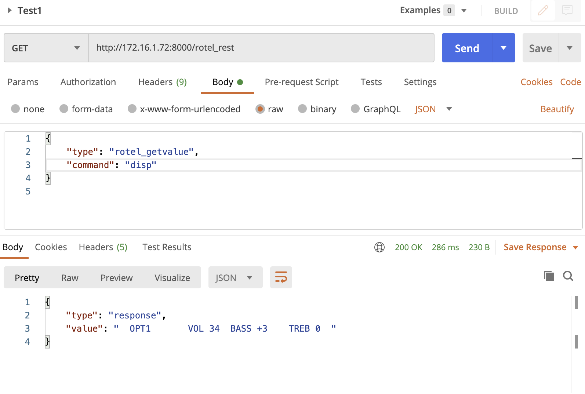
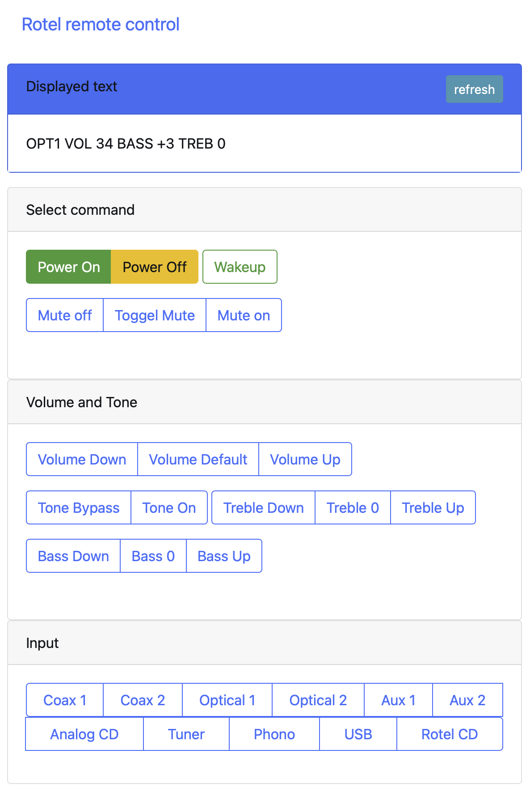

## Rest interface for remote controlling the Rotel RA12 amplifier.
I've created this interface to remotely control my Rotel RA12 amplifier from within Home Assistent. The software is build in python3 using Django and Django Channels and runs on a Raspberry Pi connected to the serial port of the amplifier.

I use a headless The Raspberry Pi zero running Debian.
For the headless Raspberry Pi setup see: [https://desertbot.io/blog/headless-raspberry-pi-4-ssh-wifi-setup](https://desertbot.io/blog/headless-raspberry-pi-4-ssh-wifi-setup)

The UART on the GPIO port of the Raspberry Pi is connected to a max3232, this is needed to convert the Pi's 3v3 to the RS232 level which the amplifier needs.

Rotel has a specification of the serial protocol the RA12 amplifier uses. This is available on their site: [https://rotel.com/sites/default/files/product/rs232/RA12 Protocol.pdf](https://rotel.com/sites/default/files/product/rs232/RA12%20Protocol.pdf). 
The same protocol is also used by the Rotel RA11 model, so this interface should in principle also work on that model (but I haven't tested this).

The software uses a Django server proces for the Rest interface. This server also offers a very simple web interface for testing in the browser. There is also a separate Django Channels process to handle the async communication with the serial port.

Note: The software is intended to live behind a firewall and has no authentication on the rest service or the website.

### Install basic tools and download project ###

	sudo apt install git vim
	git clone https://github.com/Rene1729/rotel_rest.git

### Installing python-pip, Django and other dependencies

	sudo apt install python3-pip
	sudo apt install libffi-dev 
	sudo apt install libssl-dev
	sudo apt install redis-server

	python3 -m pip install Django
	python3 -m pip install pathlib
	python3 -m pip install channels
	python3 -m pip install pyserial
	python3 -m pip install channels_redis

### Running the software ###
After installation the webserver can be started with:

	python3 manage.py runserver 0.0.0.0:8000

The worker should be started with:

	python3 manage.py runworker rotel-channel 

Note: Redis must be running for the communication between the server and the workers.

### Running as a service ###

The are also two .service files for automatically starting the services with the systemd manager. 
These services expect the Django project in the /home/pi/rotel_rest folder.
The services can be installed with the supplied Makefile 

	make install

### REST webserive ###
The rest webservice can handle requests for executing a command, setting a parameter or reading a parameter. See the file rotel_rest/consumers.py for all possible rest requests.

This can for example be tested in Postman.

### Simple test webseite ###

Example

